  

  
  
  

  
  

---

  <b>Exploring the intersection of Artificial Intelligence, Cyber Security, and Software Engineering.</b>

  This page maps technical domains behind my projects: machine learning algorithms, deep learning models, threat detection, network security, and computer engineering foundations.

  

## Core Domains

  

## Engineering Principles

  

