  

  
  
  

  
  

---

  <b>Open to collaboration on Artificial Intelligence, Cyber Security, and Software Engineering projects.</b>

  I am interested in machine learning models, cybersecurity tooling, vulnerability analysis, C++/Python algorithms, and open source development.

  

---

## Collaboration Protocol

| Signal | What it means |
| --- | --- |
| `BUILD` | There is a real project or tool to design, implement, test, or improve. |
| `RESEARCH` | There is an interesting problem in AI or Security worth exploring. |
| `SYSTEMS` | The work involves software architecture, performance, or Linux tooling. |
| `LEARNING` | The output helps developers understand AI & Cyber Security concepts. |
| `OPEN SOURCE` | The project benefits from clean interfaces and maintainable structure. |

## High-Value Collaboration Zones

### Artificial Intelligence & Machine Learning
Deep learning, neural networks, model optimization, computer vision, and NLP applications.

### Cyber Security & Defensive Tooling
Network analysis, vulnerability scanning, security automation, and threat defense tools.

### Software Engineering & Algorithms
Data structures, algorithm design in C++ and Python, clean code principles, and CLI tools.

## Contact

Feel free to send a message via email or connect on LinkedIn:

- **Email**: [ozgurkalx@gmail.com](mailto:ozgurkalx@gmail.com)
- **LinkedIn**: [ozgurkalcik](https://www.linkedin.com/in/ozgurkalcik/)
- **GitHub**: [Ozgurkalcik](https://github.com/Ozgurkalcik)
- **Kaggle**: [ozgurkalcik](https://www.kaggle.com/ozgurkalcik)
- **LeetCode**: [ozgurkalcik](https://leetcode.com/u/ozgurkalcik/)
- **X (Twitter)**: [@ozgurkalcik](https://x.com/ozgurkalcik)
